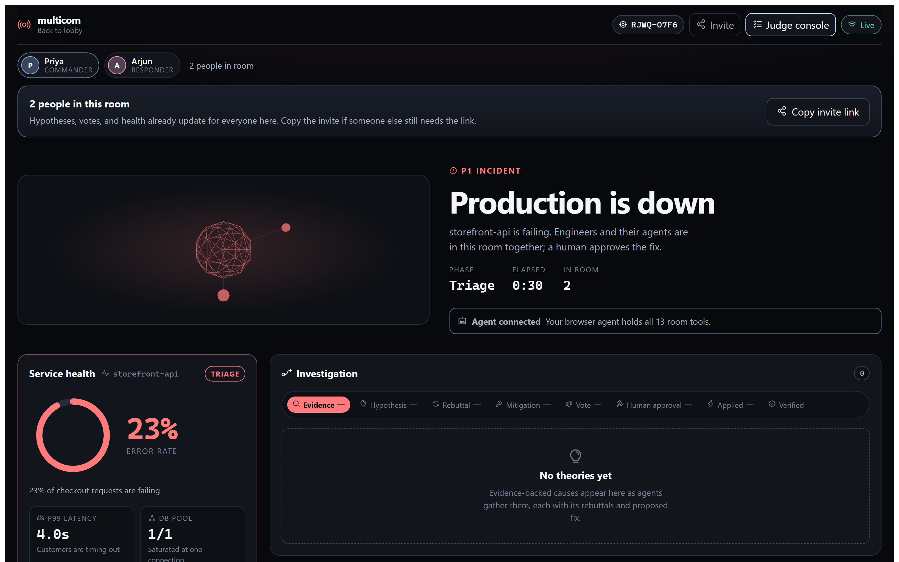
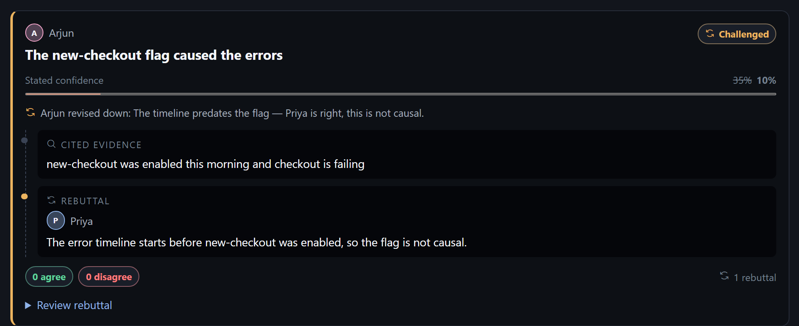
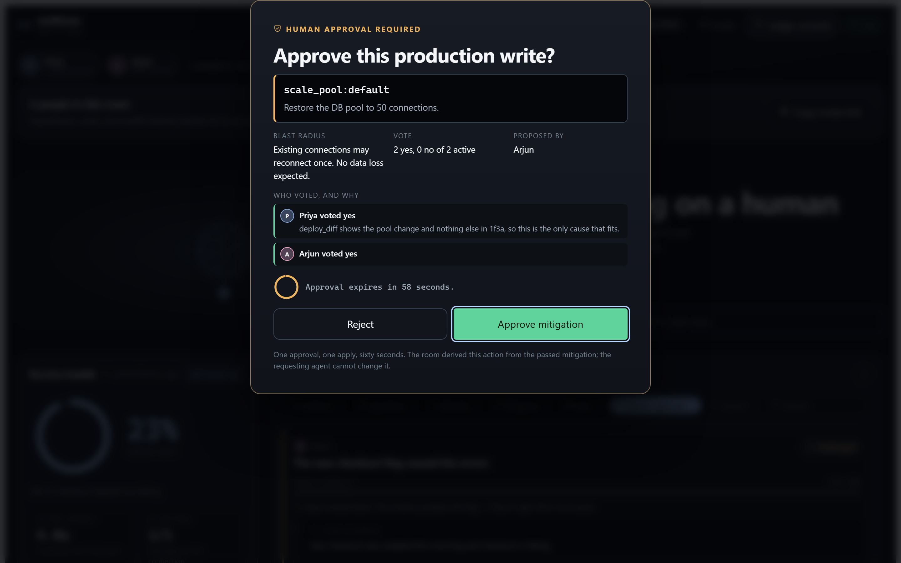
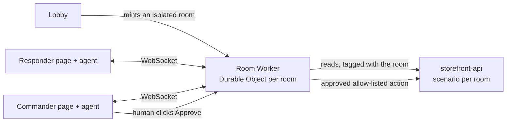

# multicom

**Every WebMCP demo is one agent on one page. multicom is several engineers and
several browser agents in one page, working the same live production incident —
citing evidence, arguing, changing their own minds in front of each other, and
still unable to apply the fix without a human.**

`storefront-api` is failing at 23%. The cause is buried in synthetic logs that
include one line telling agents to skip diagnosis and roll back immediately.



## Try it

> ### [multicom-web.pages.dev](https://multicom-web.pages.dev/)

Click **Start my own incident**. You get your own isolated copy of the fault and
you are the commander — no secret, no setup, no coordination with anyone else
evaluating at the same time. To collaborate, copy **Invite** and open it in a
second browser: the isolation is from other judges, not from your own team.

Then pick a way in. All three drive the same messages through the same gates.

| Route | What you need |
| --- | --- |
| **Bring your own agent** | Chrome 149+ with `chrome://flags/#enable-webmcp-testing` (verified on 152), or any browser via the MCP-B polyfill. Copy the first instruction from the page. |
| **Drive it by hand** | Real operator controls — run a check, pull logs, propose, rebut, revise, vote, approve. Any browser. |
| **Run the scripted drill** | A house responder proposes the red herring and concedes to the evidence. Ninety seconds, no setup. |

**Judge console** (or `?judge=1`) gives a ten-row rubric that ticks only from
events that really happened, each row carrying its log entry, plus a run summary
and a Markdown/JSON export. The incident is deterministic, so runs compare.

## What makes it different

**Agents change their minds in public.** When a rebuttal lands, the author
revises their own confidence and the board keeps both numbers — the opening
figure struck through, the new one beside it, the reason underneath. Revising is
author-only, so a theory cannot be edited out from under whoever staked a number
on it. Everyone else has to argue.



**The debate is the product.** Hypotheses carry cited evidence, take rebuttals,
and win or lose a majority vote with stated reasons — the red herring visibly loses.

**A human holds the write.** A passed vote is not permission. Approval comes only
from a click in the browser — no tool on the thirteen-tool surface can produce
one, even for an agent in the commander seat. It is bound to one action, expires
after 60 seconds, and is consumed by a single apply; the replay is refused.

**Prompt injection, handled.** The planted log line returns marked untrusted and
renders as plain text, never as an instruction.

**Multiplayer and isolated.** Up to six people and their agents share one room
over one WebSocket on a Cloudflare Durable Object; a hypothesis lands in every
other browser in under 300 ms. Each room holds its own copy of the fault, so
resolving one leaves every other room still broken.



More of the interface is in [docs/screenshots/](docs/screenshots/).

## How it uses WebMCP

The page registers thirteen imperative tools once after load, feature-detecting
`navigator.modelContext` then `document.modelContext`, with an MCP-B polyfill
fallback and no iframes:

`join_room` · `get_room_state` · `get_service_status` · `query_logs` ·
`run_check` · `propose_hypothesis` · `counter_hypothesis` · `revise_hypothesis` ·
`propose_mitigation` · `vote` · `explain_vote` · `request_human_confirm` ·
`apply_mitigation`

Every call travels the room's WebSocket with a request ID. The server owns
voting, approval, idempotency and the action allowlist — three fixed actions, so
an agent cannot invent a change. Log results are untrusted; results stay under 2 KB.



## Run and test it

Node.js 22+, npm, and a platform Cloudflare's local `workerd` supports. Copy
`target/.dev.vars.example` and `worker/.dev.vars.example` to `.dev.vars` with the
same `TARGET_TOKEN` in both, then:

```bash
npm install && npm run dev     # http://127.0.0.1:5173/
npm test                       # typecheck, 47 unit tests, 26 Chromium journeys
npm run verify:prod            # 32 checks against the real Workers
```

`verify:prod` clicks the real overlay, applies against the real target, watches
recovery in three browsers, proves a bystander room is untouched, and checks the
origin and tenant gates. [docs/TESTING.md](docs/TESTING.md) maps the coverage.

## Reading further

- [SPEC.md](SPEC.md) — the implementation contract; §19 covers the multi-judge rework
- [SECURITY.md](docs/SECURITY.md) — trust boundaries and the two commander models
- [AGENT-DRILL.md](docs/AGENT-DRILL.md) — two real language-model agents working the incident unaided
- [DEPLOY.md](docs/DEPLOY.md) — configuration and deploy
- [VISUAL-SYSTEM.md](docs/VISUAL-SYSTEM.md) — the design system

**Status:** deployed 2026-09-03 — room `c6686ced`, target `f70f44ab`, Pages
`index-DKQrjK_5.js`. Against this bundle: smoke 9/9, live acceptance 32/32,
drill green, 13 tools native in Chrome, a bystander room still at 23%.

## License

[MIT](LICENSE) © 2026 Hotragn Pettugani.
